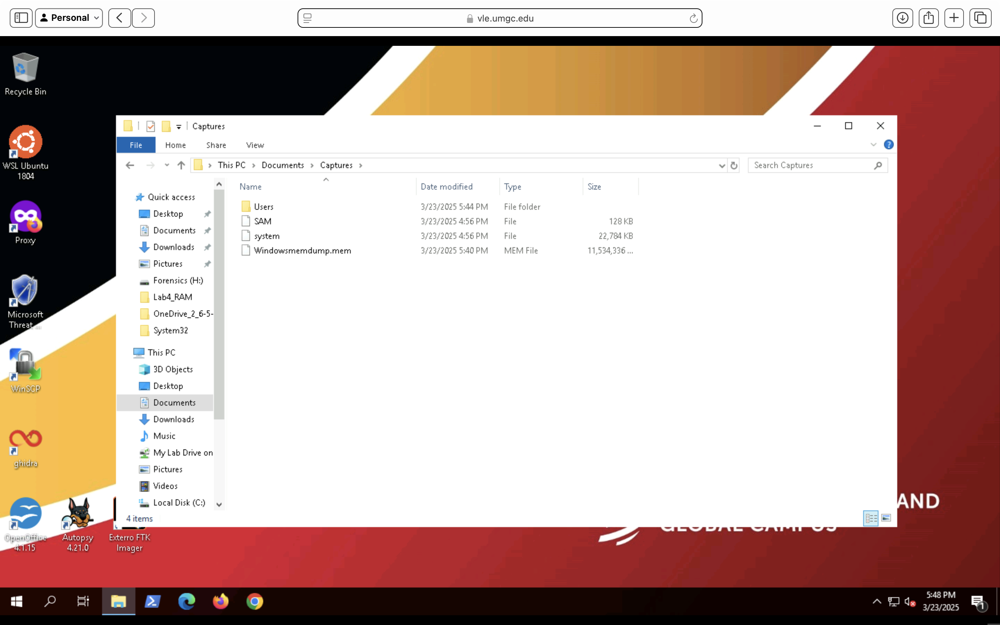
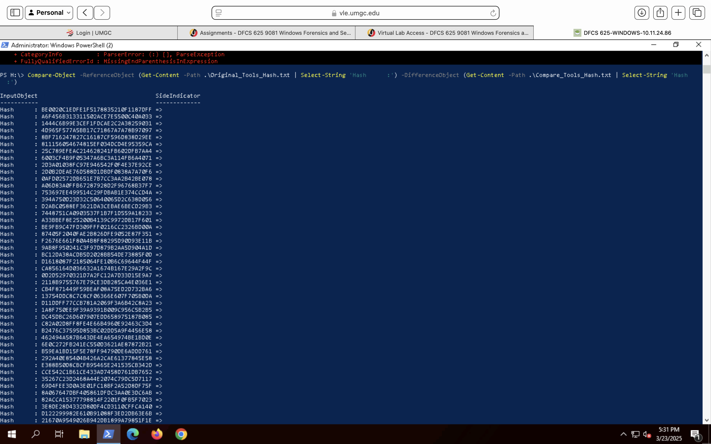
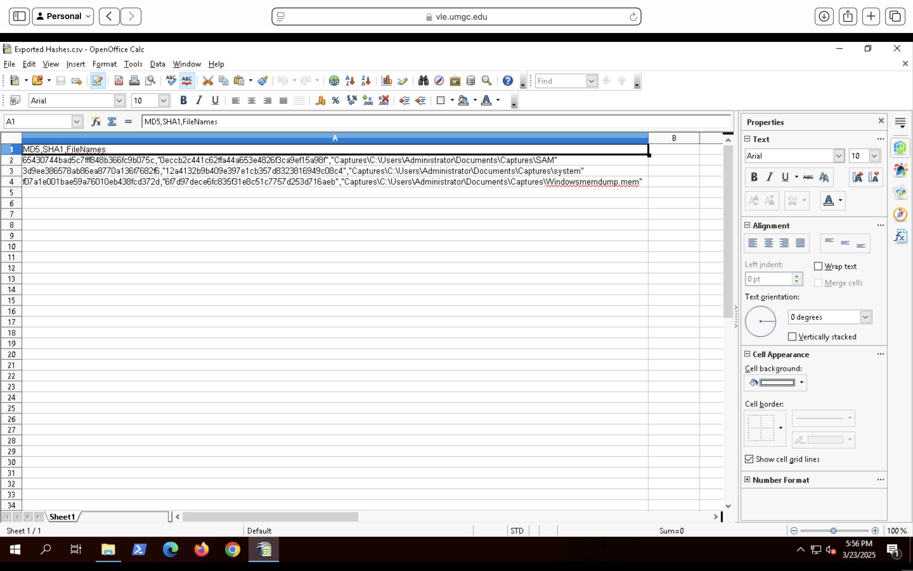

# Volatile Evidence Collection

Live-response acquisition procedures were performed to preserve volatile system artifacts prior to shutdown or alteration. Memory captures, registry hives, and user-related artifacts were collected and stored within a dedicated forensic evidence repository.

The collected evidence included:

* Physical memory image
* SAM registry hive
* SYSTEM registry hive
* User profile artifacts

Preserving these artifacts ensures that critical system state information remains available for subsequent forensic analysis and investigative review.

# Evidence Integrity Validation

Cryptographic hash values were generated and compared to verify the integrity of acquired evidence throughout the collection process. PowerShell-based validation procedures were used to compare original artifact hashes against hashes calculated after acquisition.

The validation process confirmed that all collected artifacts remained unchanged during acquisition, storage, and review activities.

# Hash Inventory Review

A comprehensive hash inventory was reviewed using OpenOffice Calc to verify completeness and document artifact-level integrity information. MD5 and SHA-1 hash values were recorded for each acquired artifact to support future verification activities and evidentiary documentation requirements.

Review of the generated inventory confirmed that all acquired artifacts were successfully cataloged and associated with corresponding cryptographic hash values.

